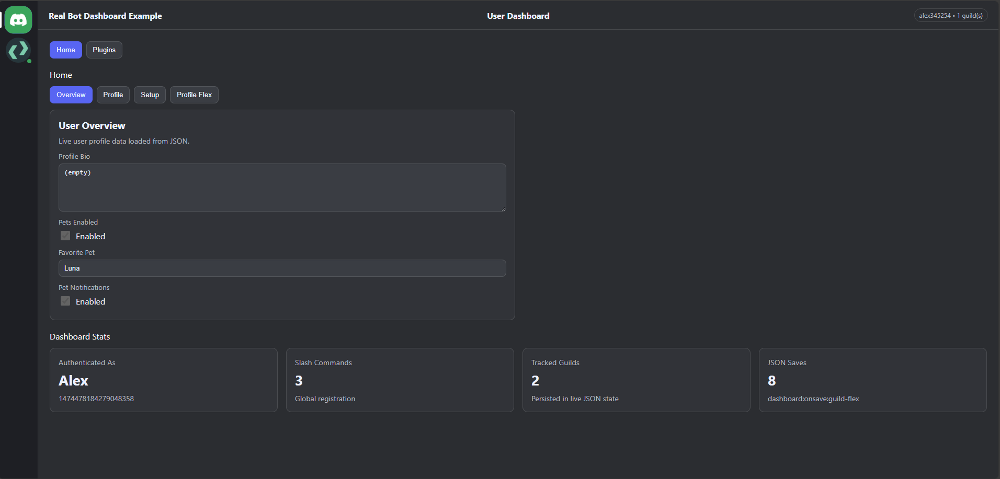
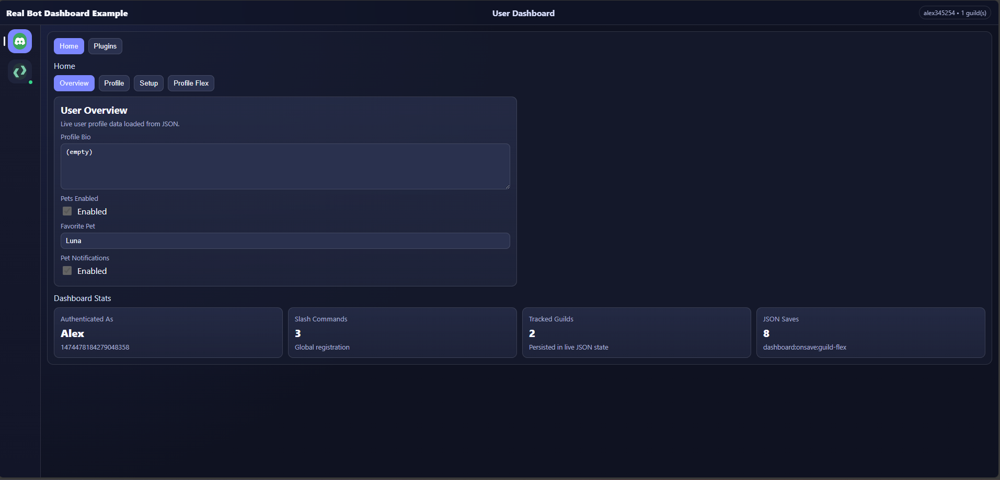
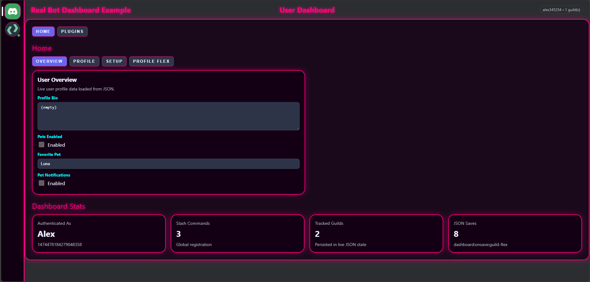

# Templates Guide

This package includes built-in UI templates and supports custom template renderers.

## Built-in Templates

### 1) `default`
- The standard dashboard layout.
- Balanced spacing and full feature presentation.

**Photo Placeholder**




### 2) `compact`
- A denser layout for smaller screens or information-heavy dashboards.
- Keeps the same core dashboard behavior with tighter visual spacing.

**Photo Placeholder**




---

## How Template Selection Works

Template resolution is handled by `TemplateManager`:

1. Reads `uiTemplate` from your options (defaults to `default`).
2. Checks `uiTemplates` for a custom renderer matching that key.
3. Falls back to built-in templates (`default`, `compact`).
4. Throws an error if the template key is unknown.

---

## Usage Example

```ts
import { DiscordDashboard } from "@developer.krd/discord-dashboard";

const dashboard = new DiscordDashboard({
	botToken: process.env.BOT_TOKEN!,
	clientId: process.env.CLIENT_ID!,
	clientSecret: process.env.CLIENT_SECRET!,
	redirectUri: "http://localhost:3000/dashboard/callback",
	sessionSecret: process.env.SESSION_SECRET!,
	uiTemplate: "compact",
});
```

---

## Custom Templates

You can register custom renderers via `uiTemplates`.

```ts
import { DiscordDashboard, type DashboardTemplateRenderer } from "@developer.krd/discord-dashboard";

const myTemplate: DashboardTemplateRenderer = ({ dashboardName, basePath }) => {
	return `<!doctype html><html><body><h1>${dashboardName}</h1><script>window.__BASE_PATH__="${basePath}"</script></body></html>`;
};

const dashboard = new DiscordDashboard({
	botToken: process.env.BOT_TOKEN!,
	clientId: process.env.CLIENT_ID!,
	clientSecret: process.env.CLIENT_SECRET!,
	redirectUri: "http://localhost:3000/dashboard/callback",
	sessionSecret: process.env.SESSION_SECRET!,
	uiTemplate: "my-custom",
	uiTemplates: {
		"my-custom": myTemplate,
	},
});
```

**Photo Placeholder**



